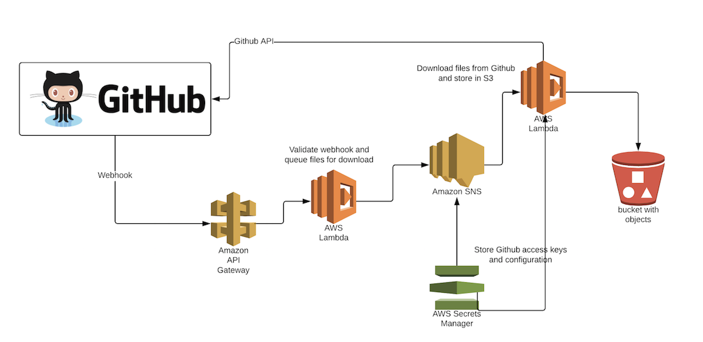

# Github-to-S3

# Architecture

# Librarys
see requirements.txt

# Configuration
The configuration for the lambda functions is stored in AWS secrets manager. There are 2 configurations that are required
- Github Configuration (/\<stage\>/githubCopy/appConfig)

```
{
  <repository Name>: {
    "repository": <repository Name>,
    "githubAPIKey": "xxxxxxxxxxxxxxxxxxxxxxxxxxxxxxxxxxxxxxxx",
    "bucket": "XXXXX",
    "githubWebhookSecret": "yyyyyyyyyyyyyyyyyyyyyyyyyyyyyyyyyyyyyyyy",
    "bucketDir": "ABCD"
  }
}
```
- S3 Access Keys (/\<stage\>/s3/appKeys)

    S3 keys are required to write into the bucket specified in the Github file copy configuration. The format is
```
{
  "aws_access_key_id": "XXXXXXXXXXXXXXXXXXXX",
  "aws_secret_access_key": "XXXXXXXXXXXXXXXXXXXXXXXXXXXXXXXXXXXXXXXX"
}
```

Different "stages" will require different configurations

# Deployment

User serverless commands to depoly to AWS

# Github
Webhook needs to registered for the github repository that needs to be copied to S3.
Serverless deploy provides the API endpoint for the webhook. The "githubwebhookSecret" used
should be the same as what has been configured in secrets manager configuration

# License

http://www.apache.org/licenses/LICENSE-2.0

# TODO

- only copy the changed files
- support branches (currently only supports master)
- support labels

